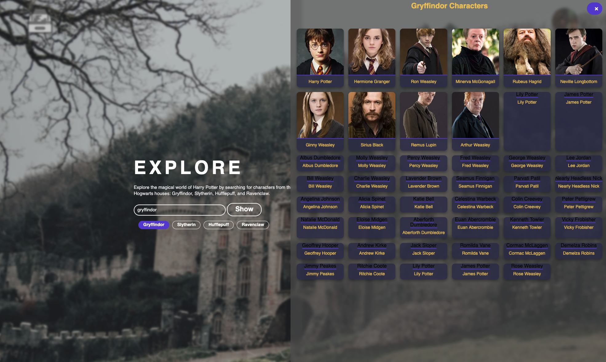

# HogwartsWiki
🧙‍♂️ Harry Potter House Explorer

Eine interaktive Webanwendung, die es Nutzern ermöglicht, Charaktere aus der Welt von Harry Potter nach ihren Hogwarts-Häusern zu filtern und anzuzeigen. In bearbeitung!

    

## 🏞️ Overview

✨ Funktionen

  * Hausauswahl: Wähle eines der vier ikonischen Hogwarts-Häuser (Gryffindor, Slytherin, Hufflepuff, oder Ravenclaw).

  * Dynamische Charakter-Anzeige: Lade und sieh alle Charaktere des gewählten Hauses in einer ansprechenden Grid-Ansicht.

  *  Responsive Design: Die Charakter-Karten passen sich an verschiedene Bildschirmgrößen an.

   * Fehlerbehandlung: Klare Fehlermeldungen bei ungültiger Eingabe oder API-Problemen.

  * Lade-Animation: Ein visuelles Feedback, während die Charakterdaten geladen werden.
